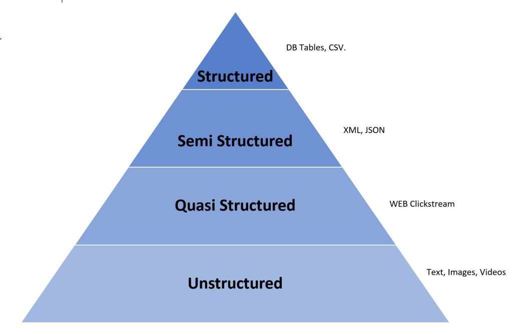
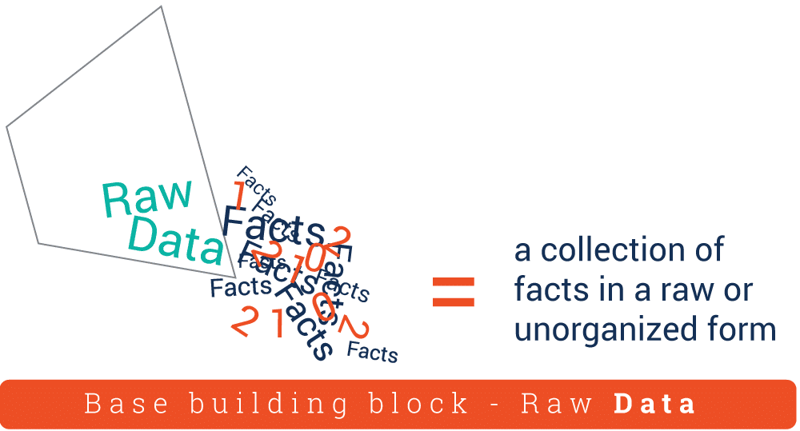
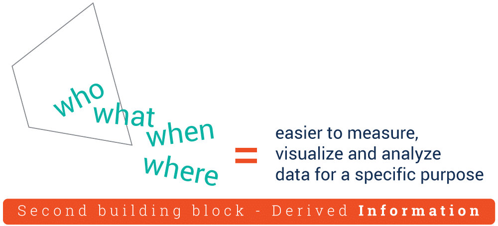
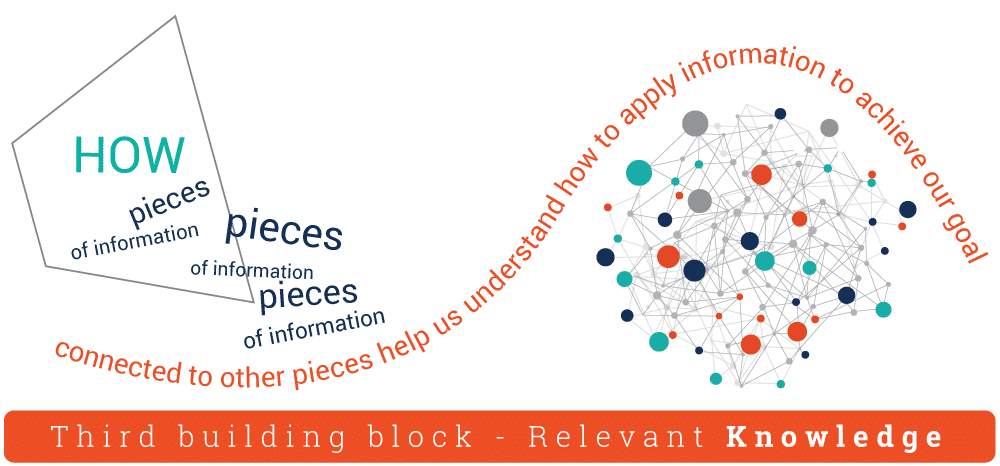
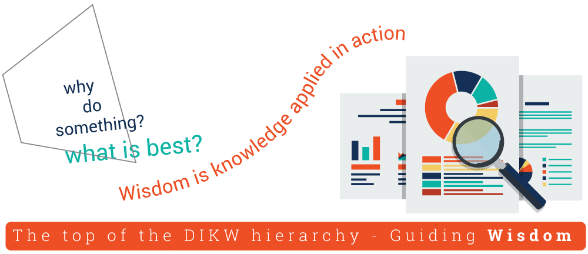
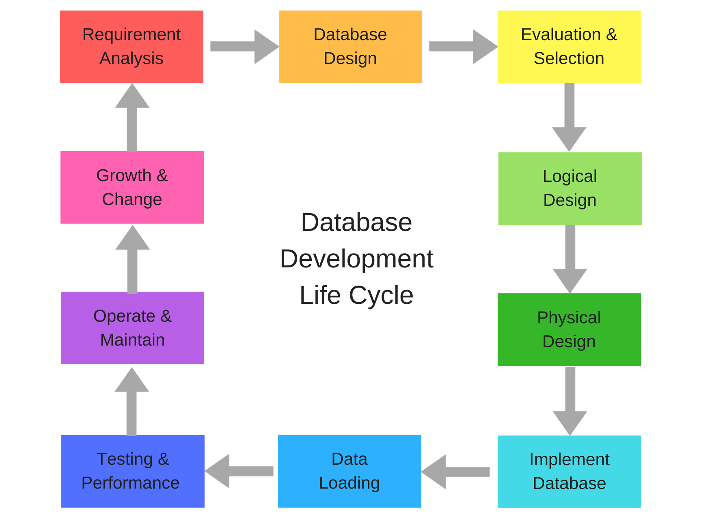
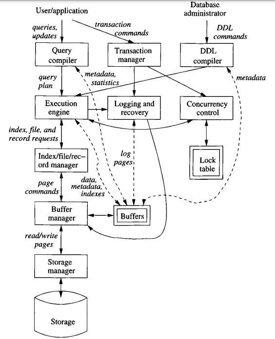

  <a href="https://www.linkedin.com/in/aminkhani-ai/" targert="_blacnk">
    
  
    
  
  

 

  <h1 align="center">Database Tutorial</h1>
  
 
     
   <a href="https://github.com/aminkhani/DB/issues/new?assignees=&labels=bug&template=bug_report.yml&title=%5BBUG%5D%3A+">🐛Report Bug</a>
   .
   <a href="https://github.com/aminkhani/DB/issues/new?assignees=&labels=question&template=question.yml&title=%5BQUESTION%5D%3A+">❓Ask Question</a>
   .
  <a href="https://github.com/aminkhani/DB/issues/new?assignees=&labels=like&template=like.yml&title=%5BLIKE%5D%3A+">👍Like the repo</a>
  .
  <a href="https://github.com/aminkhani/DB/issues/new?assignees=&labels=unlike&template=unlike.yml&title=%5BUNLIKE%5D%3A+">👎Dislike the repo</a>
  

  

  

> **Note**
>
> 📣 You can help to improve this repo, by giving me a **⭐star⭐** and **❤️following me❤️**
 

<h1 id="top">Table of Contents</h1>
<ul>
    <li><a href="#What_db">Database Definition</a>
        <ul>
            <li><a href="#type_data">Types of Data</a></li>
            <li><a href="#Pros_of_Database">Pros of Database</a></li>
        </ul>
    </li>
    <li><a href="#DIKW">DIKW</a></li>
    <li><a href="#his_db">History</a>
        <ul>
            <li><a href="#s1960s">1960s</a></li>
            <li><a href="#s1970s">1970s</a></li>
            <li><a href="#s1980s">1980s</a></li>
            <li><a href="#s1990s">1990s</a></li>
            <li><a href="#s2000s">2000s</a></li>           
             <li><a href="#s2010s">2010s</a></li>
        </ul>
    </li>
    <li><a href="#SQL">SQL</a></li>
    <li><a href="#life_cycle">Database Life Cycle</a></li>
    <li><a href="#diff_db_sheet">Difference Between Database & Spreadsheet</a></li>
    <li><a href="#type_db">Types of Databases</a>
        <ul>
            <li><a href="#rel_db">Relational Databases</a></li>
            <li><a href="#oo_db">Object-Oriented Databases</a></li>
            <li><a href="#dis_db">Distributed Databases</a></li>
            <li><a href="#warehouse">Data Warehouses</a></li>
            <li><a href="#nosql">NoSQL Databases</a></li>
            <li><a href="#graph_db">Graph Databases</a></li>
            <li><a href="#open_db">Open Source</a></li>
            <li><a href="#cloud_db">Cloud Databases</a></li>
            <li><a href="#multi_db">Multimodel Database</a></li>
            <li><a href="#json_db">Document/JSON Databases</a></li>
            <li><a href="#self_db">Self-Driving Databases</a></li>
        </ul>
    </li>
    <li><a href="#db_software">Database Software</a>
        <ul><li><a href="#DBMS">DBMS</a>
            <ul>
                <li><a href="#pros_dbms">Pros of DBMS</a></li>
                <li><a href="#popular_dbms">Popular DBMS</a></li>
            </ul>
        </li>
        </ul>
    </li>
    <li><a href="#mysql_db">MySQL Database</a></li>
    <li><a href="#Improve_Business">Improve Business Performance & Decision-Making</a></li>
    <li><a href="#db_challenge">Database Challenges</a></li>
    <li><a href="#Autonomous_Technology">Improving Database Management</a></li>
    <li><a href="#future_db">Future of Databases</a></li>
</ul>
  

<h1 id="What_db">What is Database?</h1>

- In essence a **database** is nothing more than a **collection of information** that exists over a long period of time, often many years.
 

- **Database** is an organized collection of **structured information**, or **data**, typically stored in a **computer system**. 
 

- **Database** is usually controlled by a **[Database Management System (DBMS)](#DBMS)**. Together, the **data** and the **DBMS**, along with the applications that are associated with them, are referred to as a **database system**, often shortened to just **database**.
 

- **Data** within the most common types of databases in operation today is typically modeled in **rows** and **columns** in a series of tables to make **processing** and **data querying efficient**.
 

- **Database Systems** are used to manage collections of data that:
  - are **highly valuable**,
  - are **relatively large**, and
  - are accessed by **multiple users** and applications, often at the same time.

<h2 id="type_data">Types of Data</h2>

- ### Structured Data
  - Data that is organized into a **predefined data model**. The data model defines the **type** of data, the **relationships** between different types of data, and the **constraints** that apply to the data. Examples of structured data include **customer records**, **product records**, and **order records**.

- ### Quasi-Structured Data
  -  Is **more of a textual data with erratic data formats**. It can be formatted. with effort, tools, and time. This data type includes web clickstream data such as Google searches.
- ### Semi-Structured Data
  - Is a form of structured data that does not obey the tabular structure of data models associated with relational databases or other forms of data tables, but nonetheless contains tags or other markers to separate semantic elements and enforce hierarchies of records and fields within the data.
- ### Unstructured Data
  - Data that does not conform to a **predefined data model**. Examples of unstructured data include **text**, **images**, **audio**, and **video**.

<h2 id="Pros_of_Database">Pros of Database:</h2>

**Easily:**
- Accessed
- Managed
- Modified
- Updated
- Controlled
- Organized

> Most **databases** use **[Structured Query Language (SQL)](#SQL)** for writing and querying data.

<h1 id="DIKW">DIKW</h1>

The **DIKW Pyramid represents** the **relationships between data**, **information**, **knowledge** and **wisdom**. Each **building block** is a **step** towards a higher level - **first** comes **data**, **then** is **information**, **next** is **knowledge** and **finally** comes **wisdom**. Each step answers different questions about the initial data and adds value to it. The more we enrich our data with meaning and context, the more knowledge and insights we get out of it so we can take better, informed and data-based decisions
- ### Data
 

 

- ### Information
 

 

- ### Knowledge
 

 

- ### Wisdom
 

 

<h1 id="his_db">History of Database</h1>

- ## The 1960s – Beginnings
  - **Charles Bachman** designed the first **computerised database** in the **early 1960s**.
  - This **first database** was known as the **Integrated Data Store**, or **IDS**.
  - **Computerised database** & **IDS** were forerunners of the **Navigational Database**.
  - **Navigational databases** required users to **navigate** through the entire database to find the information they wanted. There were two main models of this:
    - #### Hierarchical
      - Hierarchical model was developed by **IBM**.
      - Data was organised in a **tree-like structure**.
      - Each data entry has a **parent record**, starting with a root record.
    - #### Network
      - Released at the **Conference on Data Systems Languages (CODASYL)**.
      - Data was organised in a **graph-like structure**.
      - Differed from the **hierarchical model** in that it allowed a record to have more **than one parent and child record**.

- ## The 1970s – Relational Databases
  - **E. F. Codd** released his paper **“A Relational Model of Data for Large Shared Data Banks”**
  - **Relational database** is one that shows the **relationship** between different data records.
  - Unlike their navigational counterparts, relational databases would be **searchable**.
  - More **space-efficient**, meaning **reduced data storage costs**.
   

  - **INGRES** by **Michael Stonebreaker** and **Eugene Wong** at the University of California, Berkeley. **INGRES**, short for **Interactive Graphics and Retrieval System**, was a **relational database model**, proving the viability of Codd’s ideas.
    - **INGRES** used a query language called **QUEL**.
   

  - **IBM** then released their take on a **relational database**. Known as **System R**, it was the first in the history of databases to use **structured query language (SQL)**.

- ## The 1980s – Growth & Standardisation
  - The 1980s in the history of databases marked a time of growth. Particularly, it was the time of growth for the relational database model. Earlier navigational models faded, while the commercialisation of relational systems saw this type of database rise in use and popularity.
   

  - The 1980s also saw **SQL** become the **standard language** used for **databases**, which we still use today.
   

  - Another noteworthy event for the history of databases was the emergence of **Object-oriented database management systems (OODBMS)**. This concept appeared in the **mid-80s**. **Object databases** would view data as **‘objects’**. They would work with programming languages that supported the ‘object-oriented’ approach.

- ## The 1990s – The Internet
  - The early days of object-oriented database management did not see the idea as a popular one. This was partially due to the costs and time it would take to rewrite existing databases to support the approach. However, object oriented database systems grow more popular in the 90s.
   

  - Another key event impacting the history of databases in the 90s was the creation of the World Wide Web. High investments in online businesses fuelled demand for client-server database systems. As such, the internet helped to power exponential growth of the database industry in the 1990s.
   

  - A notable outcome of this was the creation of **MySQL** in **1995**, which was open source. This meant that it provided an alternative to the database systems offered by big companies like Oracle and Microsoft. MySQL is still used by many today. 

- ## The 2000s – NoSQL
  - In 1998, the term NoSQL (not only structured query language) was coined. It refers to databases that use query language other than SQL to store and retrieve data. NoSQL databases are useful for unstructured data, and they saw a growth in the 2000s.
   

  - This is a notable development in the history of databases because NoSQL allowed for faster processing of larger, more varied datasets. NoSQL databases are more flexible than the traditional relational databases that had risen the decade before.
  

- ## The 2010s – Distributed Databases & Cybersecurity
  - The 2010s were a decade of increased data awareness, with the rise of **big data** and an increased emphasis on data protection. And these trends naturally inform the history of databases. 
    

  - Having earned its name the decade before, big data was a major buzzword of the 2010 — and big data meant big databases to house it. With the need to collect, organise and make use of such huge reams of data, automation software has grown a popular tool when interacting with databases.
   

  - This is the decade where the value of data truly hit the public consciousness. And, with it, the importance of keeping data safe. Legislation like GDPR and the NIS directive only served to further highlight the importance of keeping data — and so databases — well protected and secure.
   

  - Alongside this is the impact of globalisation on the evolution of databases, with more attention going to **distributed databases**. These are databases that store data across **multiple physical locations**, rather than in one place.

<h1 id="SQL">What is Structured Query Language (SQL)?</h1>

**SQL** is a programming language used by nearly all **[relational databases](#rel_db)** to query, manipulate, and define data, and to provide access control.

**SQL** was first developed at IBM in the 1970s with Oracle as a major contributor, which led to implementation of the SQL ANSI standard, SQL has spurred many extensions from companies such as IBM, Oracle, and Microsoft. Although SQL is still widely used today, new programming languages are beginning to appear.    

<h1 id="life_cycle">Database Life Cycle</h1>

Like everything else, databases have a finite lifespan. The most successful database at some time is replaced by another, more flexible and up-to-date structure, and so begins life anew. Although exact definitions differ, there are generally six stages of the database lifecycle.

 

### 1. Stablishing requirements
   - Involves consultation with, and agreement among, **stakeholders** as to what they want of a system, expressed as a statement of requirements.

### 2. Analysis
   - Starts by considering the statement of requirements and finishes by producing a system specification. The specification is a formal representation of what a system should do, expressed in terms that are independent of how it may be realised.

### 3. Design 
   - Begins with a system specification and produces design documents, and provides a detailed description of how a system should be constructed.

### 4. Implementation
   - Is the construction of a computer system according to a given design document and taking account of the environment in which the system will be operating (for example specific hardware or software available for the development). Implementation may be staged, usually with an initial system than can be validated and tested before a final system is released for use.

### 5. Testing
   - Compares the implemented system against the design documents and requirements specification and produces an acceptance report or, more usually, a list of errors and bugs that require a review of the analysis, design and implementation processes to correct (testing is usually the task that leads to the waterfall model iterating through the life cycle).

### 6. Maintenance
   - Involves dealing with changes in the requirements, or the implementation environment, bug fixing or porting of the system to new environments (for example migrating a system from a standalone PC to a UNIX workstation or a networked environment). Since maintenance involves the analysis of the changes required, design of a solution, implementation and testing of that solution over the lifetime of a maintained software system, the waterfall life cycle will be repeatedly revisited.
  

<h2 id="diff_db_sheet">What’s Difference Between Database & Spreadsheet?</h2>

Databases and spreadsheets (such as Microsoft Excel) are both convenient ways to store information. The primary differences between the two are:

- How the data is stored and manipulated
- Who can access the data
- How much data can be stored

Spreadsheets were originally designed for one user, and their characteristics reflect that. They’re great for a single user or small number of users who don’t need to do a lot of incredibly complicated data manipulation. Databases, on the other hand, are designed to hold much larger collections of organized information—massive amounts, sometimes. Databases allow multiple users at the same time to quickly and securely access and query the data using highly complex logic and language.

<h1 id="type_db">Types of Databases</h1>

There are many different types of **database**s. The **best database** for a specific organization depends on how the organization **intends to use the data**.

<h2 id="rel_db">Relational Databases</h2>

- Following a famous paper written by **[Ted Codd in 1970](https://www.seas.upenn.edu/~zives/03f/cis550/codd.pdf)**, **database systems**
changed significantly. **Codd** proposed that database systems should present
the user with a **view of data** organized as **tables** called **_relations_**.
- **Relational Databases** became dominant in the **1980s**. **Items** in a **relational database** are organized as a set of **tables** with **rows &columns** . 
- **Relational Database Technology** provides the most **efficient and flexible way** to **access structured information**.

<h2 id="oo_db">Object-Oriented Databases</h2>

- Information in an object-oriented database is represented in the form of objects, as in object-oriented programming.

<h2 id="dis_db">Distributed Databases</h2>

- A distributed database consists of two or more files located in different sites. The database may be stored on multiple computers, located in the same physical location, or scattered over different networks.

<h2 id="warehouse">Data Warehouses</h2>

- Central repository for data, a data warehouse is a type of database specifically designed for fast query and analysis.

<h2 id="nosql">NoSQL Databases</h2>

- **NoSQL**, or **nonrelational database**, allows unstructured and semistructured data to be stored and manipulated (in contrast to a relational database, which defines how all data inserted into the database must be composed). NoSQL databases grew popular as web applications became more common and more complex.

 

<h2 id="graph_db">Graph Databases</h2>

- A graph database stores data in terms of entities and the relationships between entities.
  
- **OLTP databases:** An OLTP database is a speedy, analytic database designed for large numbers of transactions performed by multiple users.

These are only a few of the several dozen types of databases in use today. Other, less common databases are tailored to very specific scientific, financial, or other functions. In addition to the different database types, changes in technology development approaches and dramatic advances such as the cloud and automation are propelling databases in entirely new directions. Some of the latest databases include:

<h2 id="open_db">Open Source</h2>

- **Open source database system** is one whose source code is open source; such databases could be SQL or NoSQL databases.

<h2 id="cloud_db">Cloud Databases</h2>

- **Cloud database** is a collection of data, either structured or unstructured, that resides on a private, public, or **hybrid cloud computing platform**. There are two types of cloud database models: traditional and database as a service (DBaaS). With DBaaS, administrative tasks and maintenance are performed by a service provider.
 

<h2 id="multi_db">Multimodel Databases</h2>

- **Multimodel databases** combine different types of database models into a single, integrated back end. This means they can accommodate various data types.

<h2 id="json_db">Document/JSON Databases</h2>

- Designed for storing, retrieving, and managing document-oriented information, document databases are a modern way to store data in JSON format rather than rows and columns.

<h2 id="self_db">Self-Driving Databases</h2>

- The newest and most groundbreaking type of database, self-driving databases (also known as autonomous databases) are cloud-based and use machine learning to automate database tuning, security, backups, updates, and other routine management tasks traditionally performed by database administrators.

<h1 id="db_software">What is Database Software?</h1>

Database software is used to create, edit, and maintain database files and records, enabling easier file and record creation, data entry, data editing, updating, and reporting. The software also handles data storage, backup and reporting, multi-access control, and security. Strong database security is especially important today, as data theft becomes more frequent. Database software is sometimes also referred to as a “database management system” (DBMS).

Database software makes data management simpler by enabling users to store data in a structured form and then access it. It typically has a graphical interface to help create and manage the data and, in some cases, users can construct their own databases by using database software.

<h1 id="DBMS">What Is Database Management System (DBMS)?</h1>

**Database** typically requires a **comprehensive database software program** known as a **database management system (DBMS)**. **DBMS** serves as an **interface** between the database and its end users or programs, allowing users to **retrieve**, **update**, and **manage** how the information is organized and optimized. 

<h2 id="pros_dbms">Pros of DBMS:</h2>

- Retrieve, update, and manage data
- Facilitates oversight
- Control of databases
- Performance monitoring
- Tuning
- Backup and recovery the data

<h2 id="popular_dbms">Popular Database Software or DBMS</h2>

- MySQL
- Microsoft Access
- Microsoft SQL Server
- FileMaker Pro
- Oracle Database
- dBAS

**Database Management System (DBMS) Components**

- Single boxes represent system components
- Double boxes represent in-memory data structures
- Solid lines indicate control and data flow
- Dashed lines indicate data flow only

<h1 id="mysql_db">What is MySQL Database?</h1>

MySQL is an open source relational database management system based on SQL. It was designed and optimized for web applications and can run on any platform. As new and different requirements emerged with the internet, MySQL became the platform of choice for web developers and web-based applications. Because it’s designed to process millions of queries and thousands of transactions, MySQL is a popular choice for ecommerce businesses that need to manage multiple money transfers. On-demand flexibility is the primary feature of MySQL.

MySQL is the DBMS behind some of the top websites and web-based applications in the world, including Airbnb, Uber, LinkedIn, Facebook, Twitter, and YouTube.

<h2 id="Improve_Business">Using Databases To Improve Business Performance & Decision-Making</h2>

With massive data collection from the Internet of Things transforming life and industry across the globe, businesses today have access to more data than ever before. Forward-thinking organizations can now use databases to go beyond basic data storage and transactions to analyze vast quantities of data from multiple systems. Using database and other computing and business intelligence tools, organizations can now leverage the data they collect to run more efficiently, enable better decision-making, and become more agile and scalable. Optimizing access and throughput to data is critical to businesses today because there is more data volume to track. It’s critical to have a platform that can deliver the performance, scale, and agility that businesses need as they grow over time.

The self-driving database is poised to provide a significant boost to these capabilities. Because self-driving databases automate expensive, time-consuming manual processes, they free up business users to become more proactive with their data. By having direct control over the ability to create and use databases, users gain control and autonomy while still maintaining important security standards.

<h1 id="db_challenge">Database Challenges</h1>

Today’s large enterprise databases often support very complex queries and are expected to deliver nearly instant responses to those queries. As a result, database administrators are constantly called upon to employ a wide variety of methods to help improve performance. Some common challenges that they face include:

- ### Absorbing significant increases in data volume
  - The explosion of data coming in from sensors, connected machines, and dozens of other sources keeps database administrators scrambling to manage and organize their companies’ data efficiently.
  
- ### Ensuring data security
  - Data breaches are happening everywhere these days, and hackers are getting more inventive. It’s more important than ever to ensure that data is secure but also easily accessible to users.
  
- ### Keeping up with demand
  - In today’s fast-moving business environment, companies need real-time access to their data to support timely decision-making and to take advantage of new opportunities.
  
- ### Managing and maintaining the database and infrastructure
  - Database administrators must continually watch the database for problems and perform preventative maintenance, as well as apply software upgrades and patches. As databases become more complex and data volumes grow, companies are faced with the expense of hiring additional talent to monitor and tune their databases.
  
- ### Removing limits on scalability
  - A business needs to grow if it’s going to survive, and its data management must grow along with it. But it’s very difficult for database administrators to predict how much capacity the company will need, particularly with on-premises databases.

- ### Ensuring data residency, data sovereignty, or latency requirements 
  - Some organizations have use cases that are better suited to run on-premises. In those cases, engineered systems that are pre-configured and pre-optimized for running the database are ideal. Customers achieve higher availability, greater performance and up to 40% lower cost with Oracle Exadata, according to Wikibon’s recent analysis (PDF).
Addressing all of these challenges can be time-consuming and can prevent database administrators from performing more strategic functions.

<h2 id="Autonomous_Technology">How Autonomous Technology Is Improving Database Management</h2>

Self-driving databases are the wave of the future—and offer an intriguing possibility for organizations that want to use the best available database technology without the headaches of running and operating that technology.

Self-driving databases use cloud-based technology and machine learning to automate many of the routine tasks required to manage databases, such as tuning, security, backups, updates, and other routine management tasks. With these tedious tasks automated, database administrators are freed up to do more strategic work. The self-driving, self-securing, and self-repairing capabilities of self-driving databases are poised to revolutionize how companies manage and secure their data, enabling performance advantages, lower costs, and improved security.

<h2 id="future_db">Future of Databases & Autonomous Databases</h2>

The first autonomous database was announced in late 2017, and multiple independent industry analysts quickly recognized the technology and its potential impact on computing.

